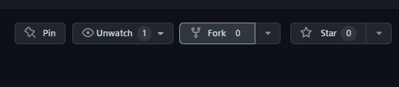
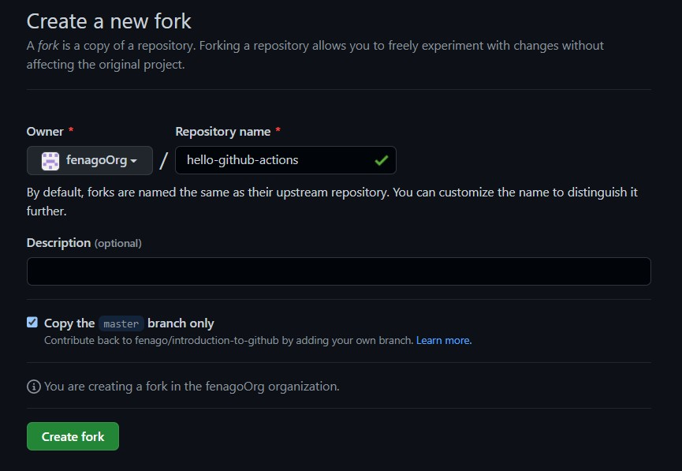

# Hello GitHub Actions

Automation is key for streamlining your work processes, and [GitHub Actions] is the best way to supercharge your workflow.

- **Who is this for**: Developers, DevOps engineers, students, managers, teams, GitHub users.
- **What you'll learn**: How to create workflow files, trigger workflows, and find workflow logs.
- **What you'll build**: An Actions workflow that will check emoji shortcode references in Markdown files.
- **How long**: This course is five steps long and can be finished in less than two hours.

## How to start this course

1. Open following URL in browser, click **Fork** and open the link in a new tab.
   `https://github.com/fenago/hello-github-actions`

   
2. In the new tab, follow the prompts to create a new repository.
   - For owner, choose your personal account or an organization to host the repository.
   - We recommend creating a public repository&mdash;private repositories will [use Actions minutes].
   
3. After your new repository is created, wait about 20 seconds, then refresh the page. Follow the step-by-step instructions in the new repository's README.


<summary><h2>Step 1: Create a workflow file</h2></summary>

_Welcome to "Hello GitHub Actions"! :wave:_

**What is _GitHub Actions_?**: GitHub Actions is a flexible way to automate nearly every aspect of your team's software workflow. You can automate testing, continuously deploy, review code, manage issues and pull requests, and much more. The best part, these workflows are stored as code in your repository and easily shared and reused across teams.

**What is a _workflow_?**: A workflow is a configurable automated process that will run one or more jobs. Workflows are defined in special files in the `.github/workflows` directory and they execute based on your chosen event. For this exercise, we'll use a `pull_request` event. 

To get you started, we used actions to go ahead and made a branch and pull request for you.

### Activity: Create a workflow file

1. Open a new browser tab, and navigate to this same repository. Then, work on the steps in your second tab while you read the instructions in this tab.
1. Navigate to the **Code** tab.
1. From the **main** branch dropdown, click on the **welcome-workflow** branch.
1. Navigate to the `.github/workflows/` folder, then select **Add file** and click on **Create new file**.
1. In the **Name your file...** field, enter `welcome.yml`.
1. Add the following content to the `welcome.yml` file:
   ```yaml
   name: Post welcome comment
   on:
     pull_request:
       types: [opened]
   ```
1. To commit your changes, click **Commit new file**.
1. Wait about 20 seconds for actions to run, then refresh this page.


<summary><h2>Step 2: Add a job to your workflow file</h2></summary>

_Nice work! :tada: You added a workflow file!_

Here's what it means:

- `name: Post welcome comment` gives your workflow a name. This name appears on any pull request or in the Actions tab of your repository.
- `on: pull_request: types: [opened]` indicates that your workflow will execute anytime a pull request opens in your repository.

Next, we need to specify jobs to run.

**What is a _job_?**: A job is a set of steps in a workflow that execute on the same runner (a runner is a server that runs your workflows when triggered). Workflows have jobs, and jobs have steps. Steps are executed in order and are dependent on each other. We'll add steps in the next step of this exercise. To read more about jobs, see "[Jobs]".

In this step of our exercise, we will add a "build" job. We will specify `ubuntu-latest` as the fastest and cheapest job runner available. If you want to read more about why we'll use that runner, see the code explanation for the line `runs-on: ubuntu-latest` in the "[Understanding the workflow file]" article.

### Activity: Add a job to your workflow file

1. Open your `welcome.yml` file. 
2. Update the contents of the file to:
   ```yaml
   name: Post welcome comment
   on:
     pull_request:
       types: [opened]
   jobs:
     build:
       name: Post welcome comment
       runs-on: ubuntu-latest
   ```
3. Click **Start commit** in the top right of the workflow editor.
4. Type your commit message and commit your changes directly to your branch.
5. Wait about 20 seconds for actions to run, then refresh this page.


<summary><h2>Step 3: Add actions to your workflow file</h2></summary>

_Nice work adding a job to your workflow! :dancer:_

Workflows have jobs, and jobs have steps. So now we'll add steps to your workflow.

**What are _steps_?**: Actions steps will run during our job in order. Each step is either a shell script that will be executed, or an action that will be run. Each step must pass for the next step to run. Actions steps can be used from within the same repository, from any other public repository, or from a published Docker container image.

In our action, we post a comment on the pull request using a [bash](https://en.wikipedia.org/wiki/Bash_%28Unix_shell%29) script and [GitHub CLI](https://cli.github.com/).

### Activity: Add Actions steps to your workflow file

1. Open your `welcome.yml` file.
2. Update the contents of the file to:
   ```yaml
   name: Post welcome comment
   on:
     pull_request:
       types: [opened]
   jobs:
     build:
       name: Post welcome comment
       runs-on: ubuntu-latest
       steps:
         - run: gh pr comment $PR_URL --body "Welcome to the repository!"
           env:
             GITHUB_TOKEN: ${{ secrets.GITHUB_TOKEN }}
             PR_URL: ${{ github.event.pull_request.html_url }}
   ```
3. Click **Start commit** in the top right of the workflow editor.
4. Type your commit message and commit your changes directly to your branch.
5. Wait about 20 seconds for actions to run, then refresh this page.

<summary><h2>Step 4: Merge your workflow file</h2></summary>

_You're now able to write and run an Actions workflow! :sparkles:_

Merge your pull request so the action will be a part of the `main` branch.

### Activity: Merge your workflow file

1. In your repo, click on the **Pull requests** tab.
2. Click on the **Post welcome comment workflow** pull request.
3. Click **Merge pull request**, then click **Confirm merge**.
4. Optionally, click **Delete branch** to delete your `welcome-workflow` branch.
5. Wait about 20 seconds for actions to run, then refresh this page.


<summary><h2>Step 5: Trigger the workflow</h2></summary>

_You've now got a fully functioning workflow! :smile:_

Your new action will run any time a new commit is created or pushed to the remote repository. Since you just created a commit, the workflow should have been triggered.

**Seeing your _action_ in action**: The status of your action is shown in a pull request before you merge, look for **All checks have passed** when you try out the steps below. You can also view them from the **Actions** tab in your repository. From there, you will see all the actions that have run, and you can click on each action to view details and access log files.


### Activity: Trigger the workflow

1. Make a new branch named `test-workflow`.
1. Commit any change to your branch, such as adding an emoji to your README.md file.
2. Create the pull request on your branch.
3. See your action run on your pull request.
4. Wait about 20 seconds for actions to run, then refresh this page.


<summary><h2>Finish</h2></summary>

_Congratulations friend, you've completed this course!_

Here's a recap of all the tasks you've accomplished in your repository:

- You've created your first GitHub Actions workflow file.
- You learned where to make your workflow file.
- You created an event trigger, a job, and steps for your workflow.
- You're ready to automate anything you can dream of.
